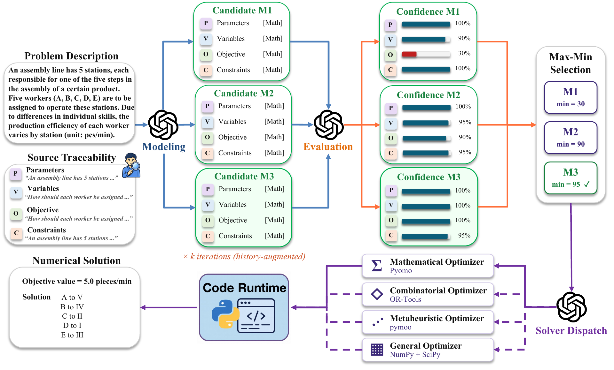

# COOPA: A Modular LLM Agent Architecture for Operations Research Problems

COOPA is a multi-agent framework for solving operations research and optimization
problems with large language models. A **manager agent** extracts a structured
formulation of each problem and delegates it to a specialized **optimizer agent**
— mathematical / algebraic (Pyomo + GLPK/IPOPT), combinatorial (Google OR-Tools),
metaheuristic (pymoo), or general-purpose (Python) — which writes and executes
solver code and returns the objective value.

The main application is under [`apps/operations_research/`](apps/operations_research/),
which holds the agents, prompts, and experiment runner used to evaluate the system
on standard OR benchmarks (`industryor`, `complexlp`, `BWOR`).

## Architecture

<p align="center">
  
</p>

**Workflow**

1. **Model** — an LLM turns the problem (parameters, variables, objective,
   constraints, with source traceability) into one or more candidate
   `OptimizationFormulation`s.
2. **Evaluate & select** — each candidate is scored for confidence and the
   highest-confidence formulation is kept. With `--use_iterative_refinement`,
   modeling and evaluation repeat (history-augmented) for up to
   `--max_refinement_iterations` rounds.
3. **Dispatch** — the manager routes the selected formulation to the single most
   suitable optimizer agent — mathematical (Pyomo), combinatorial (OR-Tools),
   metaheuristic (pymoo), or general (NumPy/SciPy); it never writes solver code itself.
4. **Solve & score** — the optimizer writes and executes solver code on its backend,
   returns the objective value, and it is compared against the gold answer.

## Setup

### 1. Clone
```bash
git clone git@github.com:xxxxxa-hub/COOPA.git
cd COOPA
```

### 2. Install dependencies

One command (conda) installs Python, the Pyomo solver binaries (GLPK, IPOPT), and
all Python packages:
```bash
conda env create -f environment.yml
conda activate coopa_env
```

### 3. Configure API keys
Copy the example env file and fill in your keys (do **not** wrap values in quotes):
```bash
cp .env.example .env
# Edit .env and fill in your API keys
```
See `.env.example` for the keys used — your LLM provider key (OpenAI / OpenRouter)
and the web-search keys used by the web-browsing agent.

## Results

Accuracy (%) across three benchmarks and eight LLM backbones. **Bold** indicates the
best method for each model. COOPA achieves the highest macro-average on 6 of 8 backbones.

| Model | Method | ComplexLP | IndustryOR | BWOR | Macro-Avg |
|---|---|:--:|:--:|:--:|:--:|
| **GPT-5.2** | Chain-of-Experts | 55.5 | 70.0 | 75.0 | 66.8 |
|  | OptiMUS | 14.2 | 14.0 | 25.0 | 17.7 |
|  | OptiTree | 53.6 | 74.0 | 77.5 | 68.4 |
|  | OR-LLM-Agent | 49.8 | 70.0 | 78.8 | 66.2 |
|  | **COOPA (Ours)** | **55.9** | **76.0** | **80.0** | **70.6** |
| **GPT-5** | Chain-of-Experts | 48.8 | 63.0 | 76.3 | 62.7 |
|  | OptiMUS | 38.4 | 43.0 | 47.5 | 43.0 |
|  | OptiTree | 43.1 | 54.0 | 52.5 | 49.9 |
|  | OR-LLM-Agent | 40.3 | 63.0 | 67.5 | 56.9 |
|  | **COOPA (Ours)** | **53.1** | **75.0** | **80.0** | **69.4** |
| **GPT-4.1** | Chain-of-Experts | 43.6 | 60.0 | 70.0 | 57.9 |
|  | OptiMUS | 39.3 | 48.0 | 58.8 | 48.7 |
|  | OptiTree | 49.3 | 62.0 | 68.8 | 60.0 |
|  | OR-LLM-Agent | 45.5 | 61.0 | 71.3 | 59.3 |
|  | **COOPA (Ours)** | **53.6** | **69.0** | **76.3** | **66.3** |
| **o3** | Chain-of-Experts | **55.5** | 72.0 | 75.0 | **67.5** |
|  | OptiMUS | 36.0 | 43.0 | 42.5 | 40.5 |
|  | OptiTree | 43.1 | **75.0** | 78.8 | 65.6 |
|  | OR-LLM-Agent | 47.9 | 64.0 | **80.0** | 64.0 |
|  | **COOPA (Ours)** | 53.6 | 73.0 | 73.8 | 66.8 |
| **o4-mini** | Chain-of-Experts | 48.3 | 69.0 | 68.8 | 62.0 |
|  | OptiMUS | 34.6 | 43.0 | 43.8 | 40.5 |
|  | OptiTree | **52.6** | 65.0 | 71.3 | 63.0 |
|  | OR-LLM-Agent | 47.4 | 68.0 | **78.8** | 64.7 |
|  | **COOPA (Ours)** | 47.9 | **72.0** | 77.5 | **65.8** |
| **Gemini-3-Flash** | Chain-of-Experts | 47.4 | **75.0** | 75.0 | 65.8 |
|  | OptiMUS | 38.4 | 26.0 | 28.8 | 31.1 |
|  | OptiTree | **60.2** | 67.0 | 75.0 | 67.4 |
|  | OR-LLM-Agent | 52.6 | 69.0 | **81.3** | 67.6 |
|  | **COOPA (Ours)** | 52.6 | **75.0** | 77.5 | **68.4** |
| **Gemini-2.5-Flash** | Chain-of-Experts | 49.3 | 32.0 | 47.5 | 42.9 |
|  | OptiMUS | 27.0 | 35.0 | 36.3 | 32.8 |
|  | OptiTree | **53.6** | 62.0 | 70.0 | 61.9 |
|  | OR-LLM-Agent | 46.4 | 67.0 | 70.0 | 61.1 |
|  | **COOPA (Ours)** | 47.4 | **71.0** | **77.5** | **65.3** |
| **Qwen3-30B**<sup>†</sup> | Chain-of-Experts | 42.2 | 57.0 | **67.5** | **55.6** |
|  | OptiMUS | 23.7 | 28.0 | 35.0 | 28.9 |
|  | OptiTree | **46.4** | 55.0 | 61.3 | 54.2 |
|  | OR-LLM-Agent | 38.9 | **58.0** | 62.5 | 53.1 |
|  | **COOPA (Ours)** | 32.2 | 48.0 | 56.3 | 45.5 |

<sup>†</sup> Qwen3-30B is shorthand for Qwen3-30B-A3B-Thinking-2507.

Accuracy is the number of correct answers divided by the total number of problems in
each benchmark (BWOR uses 80, since 2 of its 82 problems have no ground truth). A few
problems that time out are missing from the result files and are counted as incorrect,
which does not change the denominator.

Full experiment **logs**, extracted **formulations**, and per-problem solver **code**
for all runs are available on
[Google Drive](https://drive.google.com/drive/folders/1hgRaV_A9v_dHiHJPRznu_-61RDQKb-cF?usp=sharing).

## Running Experiments

Batch-evaluate a dataset with the experiment runner:
```bash
python -m apps.operations_research.run_exp_with_kb_full_multiprocess \
  --dataset BWOR \
  --model_id o4-mini \
  --num_processes 8
```

or via the convenience wrapper:
```bash
./apps/operations_research/run_multiprocess.sh -d BWOR -m o4-mini -p 8
```

**Key arguments**
- `--dataset`: `industryor` | `complexlp` | `BWOR` (default `industryor`)
- `--model_id`: any LiteLLM-compatible model ID (default `o4-mini`)
- `--num_processes`: parallel workers (default: 1)
- `--use_iterative_refinement` / `--max_refinement_iterations`: iterative formulation refinement

Each problem is formulated, delegated to an optimizer agent, solved, and scored
against the gold answer. Everything for a run lives under `results/{dataset}_{model}/`:
the results JSONL (`experiment_results_{timestamp}.jsonl`), the per-problem logs
(`logs/..._question_{idx}_log.txt`), and each problem's extracted formulation and
generated solver code (`working_directory/problem_{idx}/`). Each result row records
the predicted answer, the gold answer, and whether they match.

### Interactive mode
Launch the Gradio web app and solve problems by typing them in natural language;
each problem is formulated and solved through the full pipeline:
```bash
python -m apps.operations_research.run --model_id o4-mini --mode gradio --use_iterative_refinement
```
Open the local (or public share) URL it prints, paste a problem, and the app
displays the extracted formulation (with candidate confidence scores) and the solved
answer. Drop `--use_iterative_refinement` for single-pass formulation, or use
`--mode cli` for a terminal chat instead.
